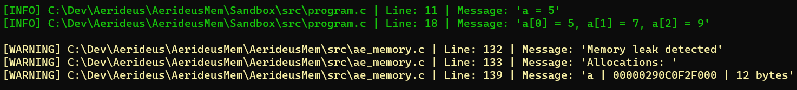

# Aerideus Mem

Aerideus Mem is a lightweight and easy to use library for memory tracking. The library contain wrappers for memory functions like `malloc`, `realloc` and `free` that track the location and size of current allocations. The library functions only track allocations for *debug* builds and have no impact on performance for *release* or *distribution* build as the macros are replaced by the functions from the standard C library.

<br>

## Getting started

Aerideus Mem is very easy to set up and use.

1. Clone the main branch of the repository for the latest stable version.
2. Run the `Premake5` file for your preferred IDE. The included *.bat* file can be used for `Windows` and `Visual Studio 2022`.
3. Run the demo program to see if everything is working as intended. The `Sandbox` project conitain some example code to demonstrate features of the library.
4. The library can be compiled and linked into any project together with the `include` directory in `AeridesLog`. Alternatively, modify the `Premake5` file to create and link your own project.

Aerideus Mem can be used in any project, free of charge, as long as the required files are included. For more information about use and warranty, see license file.

<br>

---

## General

Aerideus Mem is a memory tracking library in C to simplify application development. The library can track all current allocations and list them when requested. When listed, information about the variable name, memory location and size of the allocation. Additionally, the library can warn about detected memory leaks when the application is closed. Below is a screenshot of the console output from a simple program:



<br>

---

## Dependencies

Aerideus Log must be linked to both Aerideus Mem and to the application using it. The source code to a version of Aerideus Log is included in the repository and is automatically linked to the other projects in the `Premake5` file. If you choose to write your own `Premake5` file or use a different tool to build project files, remember to link a version of Aerideus Log (*any version should work*).

---

## Preprocessor definitions

For the library to work as intended, there are several preprocessor definitions that are defined in the `premake5.lua` file. They specify the build configuration and platform. If you choose to write your own `Premake5` file or use a different tool to build project files, the following preprocessor definitions must be defined.

| Preprocessor definition | Build type |
| ----------------------- | ---------- |
| AE_DEBUG                | Debug build |
| AE_RELEASE              | Release build |
| AE_DIST                 | Distribution build |

| Preprocessor definition | Platform |
| ----------------------- | -------- |
| AE_WINDOWS              | Windows  |
| AE_MACOS                | MacOS    |
| AE_LINUX                | Linux    |

<br>

---

## Memory functions

Aerideus Mem include macros to use instead of standard memory functions. The macros call internal wrapper functions that track the allocations to allow the library to detect memory leaks or list all current allocations. However, these are replaced by the standard library functions for release and distribution build, which means that the library has no impact on performance when the application is released. Below is a table showing the standard library functions and the macros to be used instead.

| Standard library function | Aerideus Mem macro |
| ------------------------- | ------------------ |
| malloc | AE_MALLOC |
| calloc | AE_CAlLOC |
| realloc | AE_REALLOC |
| free | AE_FREE |

### Memory function examples

Below is an example of how the Aerideus Mem macros can be used instead of the standard library functions.

```c
int* a;

// Allocates 4 bytes of memory
AE_MALLOC(a, sizeof(int));
*a = 5;
// Logs the value of a to the console
AE_LOG_CONSOLE_INFO("a = %d", *a);

// Changes the size of the allocation to 12 bytes
AE_REALLOC(a, sizeof(int) * 3);

a[1] = 7;
a[2] = 9;

// Logs all values in the array to the console
AE_LOG_CONSOLE_INFO("a[0] = %d, a[1] = %d, a[2] = %d", a[0],a[1], a[2]);

// Deallocates the allocated memory
AE_FREE(a);

// Checks for memory leaks before terminating and logsresult to the console
AE_LOG_LEAKS_CONSOLE();
```

<br>

---

## Allocations listing

Aerideus Log has *5* severity levels that are specified through an `enum` called `log_level`. The 5 levels are `TRACE`, `INFO`, `WARNING`, `ERROR` and `FATAL`. How these levels are intended to be used can be found in the table below:

| Severity level | Purpose |
| -------------- | ------- |
| TRACE          | Information of low importance |
| INFO           | Information of high importance |
| WARNING        | Problems of low importance |
| ERROR          | Problems of high importance |
| FATAL          | Problems that requires termination |

These are used to specify the severity of the log when listing current allocations. This can be done using the following example code:

```c
// Logs all current allocations to the console with severity level INFO
AE_LOG_ALLOCATIONS_CONSOLE(INFO);

// Logs all current allocations to the log file with severity level WARNING
AE_LOG_ALLOCATIONS_FILE(WARNING);
```

<br>

---

## Memory leaks

A check to see if anything is still allocated can be performed and logged either to the console or to the log file. This should always be done at the end of the program, except if the log file is exported which should be done afterwards. The check is done through macros `AE_LOG_LEAKS_CONSOLE()` and `AE_LOG_LEAKS_FILE()` and one of them should always be used before termination.

<br>

---

Last modified: 2023-03-31

Copyright (c) 2023 Aerideus
